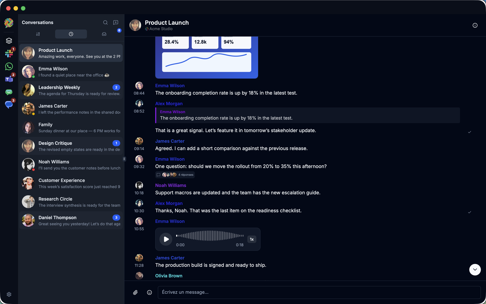
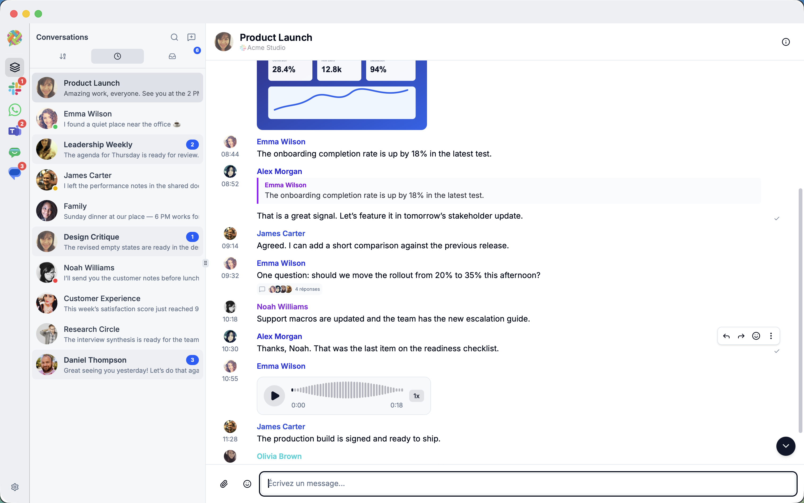
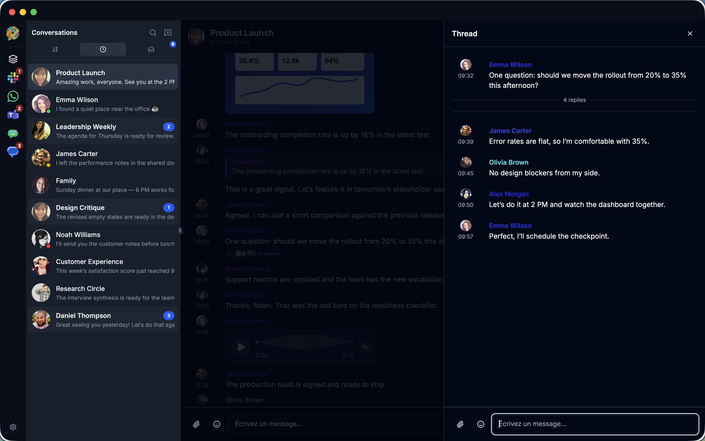
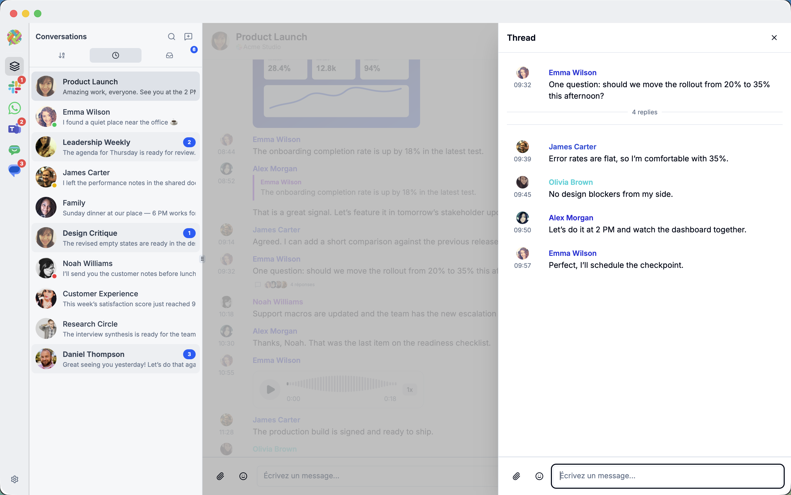

# Loom — Unified Messaging Desktop App

> **Note:** This is a vibecoded project — built fast, iterated freely, and shaped by experimentation rather than a formal spec.

Loom is a desktop application that brings multiple messaging services into a single interface. Connect WhatsApp, Slack, Microsoft Teams, Google Chat, and Google Messages, and manage all your conversations from one place.

---

## How it works

Loom runs entirely on your machine. There is **no intermediate server** — unlike bridge-based approaches (such as a Matrix homeserver), the app connects directly to each messaging service using their native protocols or APIs. Your messages are never routed through a third-party relay.

When you add a new account, Loom fetches a few dozen recent messages to give you immediate context. On subsequent launches, it picks up where it left off: messages received since the last session are synced automatically.

---

## Screenshots

| Dark theme | Light theme |
|---|---|
|  |  |
|  |  |

---

## Supported providers

| Feature | WhatsApp | Slack | Teams | Google Chat | Google Messages |
|---|:---:|:---:|:---:|:---:|:---:|
| Send / receive messages | ✓ | ✓ | ✓ | ✓ | ✓ |
| Threads / replies | — | ✓ | ✓ | ✓ | — |
| Reactions | ✓ | ✓ | ✓ | ✓ | ✓ |
| Custom emoji | — | ✓ | — | — | — |
| Typing indicator | ✓ | ✓ | ✓ | — | — |
| Group / channel management | ✓ | ✓ | ✓ | ✓ | — |
| Edit message | ✓ | ✓ | ✓ | ✓ | — |
| Delete message | ✓ | ✓ | ✓ | ✓ | ✓ |
| File attachments & inline media | ✓ | ✓ | ✓ | ✓ | ✓ |
| Read receipts | ✓ | — | ✓ | — | — |
| Contact presence | ✓ | ✓ | ✓ | — | — |
| Pin / mute conversations | ✓ | — | — | — | — |
| QR code authentication | ✓ | — | — | — | — |

**Teams — authentication:** uses Microsoft's browser-based device-code flow. Loom opens a browser, fills in the temporary code and lets Microsoft handle credentials, MFA and Conditional Access. Passwords and browser cookies are not stored by Loom.

**Teams — presence:** available for one-to-one conversations, refreshed approximately once per minute. Loom also reconnects the event stream and syncs missed messages after the computer resumes from sleep.

### Group and channel management

Group operations use a provider-neutral capability model: the frontend only
shows actions supported by the service that owns the conversation.

| Operation | WhatsApp | Slack | Teams | Google Chat |
|---|:---:|:---:|:---:|:---:|
| Create a group / space / channel | ✓ | ✓ | ✓ | ✓ |
| Rename | ✓ | ✓ | ✓ | ✓ |
| Edit description | ✓ | ✓ | ✓ | — |
| Change group photo | ✓ | — | — | — |
| Add members | ✓ | ✓ | ✓ | ✓ |
| Remove members | ✓ | ✓ | ✓ | ✓ |
| Promote / demote administrators | ✓ | — | ✓ | ✓ |
| Leave | ✓ | ✓ | ✓ | ✓ |

The conversation details panel displays remote group metadata and participants,
and lets authorized users perform the available operations. Changes made from
another client are reflected through real-time WhatsApp group events and
periodic remote refreshes for all compatible providers.

After a group rename is confirmed by the provider, Loom immediately updates the
conversation name in both the message header and the conversation list. The new
name is also persisted in the local conversation, linked account, and unified
contact records so subsequent refreshes and application restarts keep the
updated value. This update path is provider-neutral and applies to every
provider that advertises the rename capability.

Loom also exposes a generic `canSendMessages` state. Read-only conversations
show their history without a composer. This currently covers archived Slack
channels, Google Chat memberships that are not in the `JOINED` state, Teams
group chats the current user has left, and WhatsApp announcement groups where
the current user isn't an administrator.

When the last member leaves a Slack channel, Slack requires the channel to be
archived instead; Loom performs that fallback automatically.

> **Note:** The Teams integration uses the same private web services as the Teams client through a maintained fork of `mautrix-teams`. These are not public Microsoft Graph APIs and may change without notice.

---

## Tech stack

- **Backend:** Go + [Wails v2](https://wails.io/) (no Electron, no Node.js runtime)
- **Frontend:** React + TypeScript + Vite + TailwindCSS + [shadcn/ui](https://ui.shadcn.com/)
- **State management:** Zustand
- **Database:** SQLite (local, on-device)
- **i18n:** react-i18next

### Protocol libraries

The protocol layer relies on the excellent [mau.fi](https://mau.fi/) libraries:

- [whatsmeow](https://github.com/tulir/whatsmeow) — WhatsApp
- [slack-go](https://github.com/slack-go/slack) — Slack
- [mautrix-gmessages](https://github.com/mautrix/gmessages) — Google Messages
- [mautrix-teams](https://github.com/yawks/mautrix-teams) — Microsoft Teams

Google Chat connects through the official Google Chat REST API.

### UI inspiration

The layout draws heavily from [Element Web](https://github.com/element-hq/element-web), the reference Matrix client, whose three-panel design (sidebar / conversation list / message view) sets the standard for multi-account messaging interfaces.

---

## Development

### Prerequisites

- [Go 1.21+](https://golang.org/dl/)
- [Node.js LTS](https://nodejs.org/)
- [Wails CLI v2](https://wails.io/docs/gettingstarted/installation)

```bash
go install github.com/wailsapp/wails/v2/cmd/wails@latest
```

### Run in dev mode

```bash
cd frontend && npm install
cd ..
wails dev
```

### Mock mode

Launch Loom with a fully isolated, deterministic set of fake accounts,
conversations and messages:

```bash
wails dev -appargs "--mock"
```

For a built application, pass the flag directly:

```bash
./Loom --mock
```

Mock mode uses an in-memory database and never loads real accounts or messages.
The General settings remain usable and Accounts displays fake Slack and WhatsApp
accounts.

### Build for production

```bash
cd frontend && npm install && npm run build
cd ..
wails build
# output: build/bin/
```
